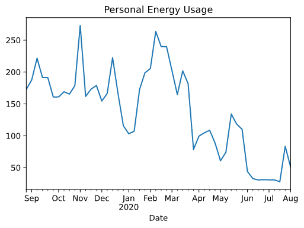
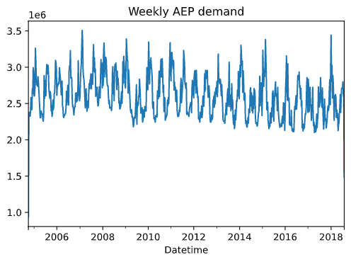
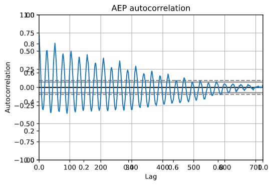
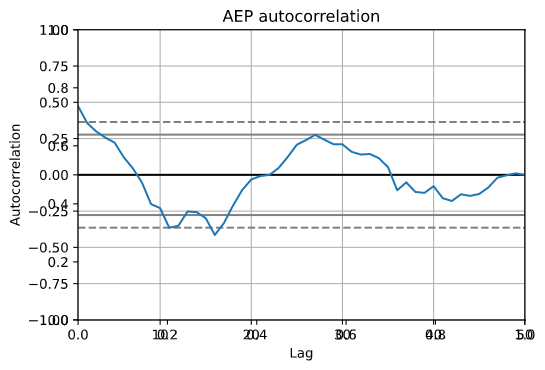
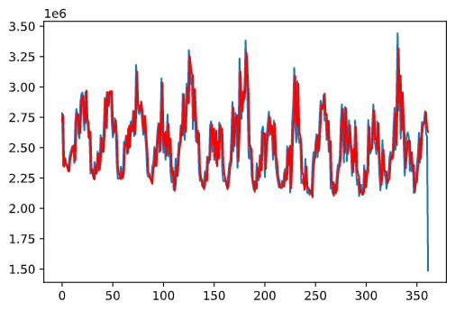
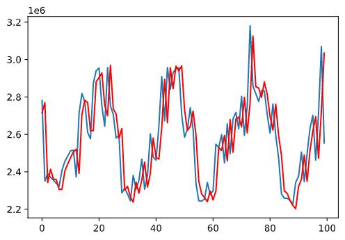
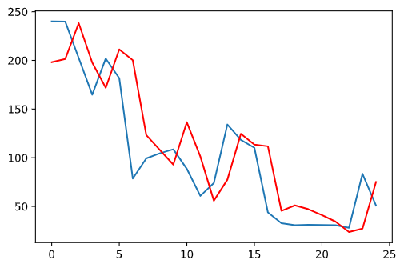

[]() 
### A Project to Forcast My Montly Power Usage And Bill

I decided to start this project to help me accurately budget my montly bills. My montly electric bill swings wildly each month, depending on the season and other factors such as the acedemic calendar. I wanted to build a forcast system to automatically tell me how much I should expect to spend each month on power.
## Project Overview:
- Created a tool thate forcasts my weekly and montly power usage in my apartment in order to help me budget and reduce my power bills.
- Utilized time series datasets including my personal daily power usage data from as well as AEP's hourly power demand dataset to test forcasting methods.
- Engineered data to fit requirements for the model
- Implemented an Auto Regressive Integrated Moving Average model for forcasting.

## Code and Resources Used 
**Python Version:** 3.7  
**Packages:** pandas, numpy, statsmodels, matplotlib, pickle  
**For Requirements:**  ```pip install -r requirements.txt```  

# Development Process:
### Data Collection:
I first downloaded my personal daily power consumption for the 2019-2020 year. You can see the raw usage data from my appartment here:



Due to a lack of data (Only being a resident in my appartment for a year), I tested my model and data manipulation on a larger dataset. I chose to test on The AEP hourly power demand which is
[avaliable through kaggle.](https://www.kaggle.com/robikscube/hourly-energy-consumption) 
I used this data to test a model. As more data becomes avaliable for my personal data, I will use the same process to build a personal model and have it updated montly with new data.

Here is the weekly AEP demand plot:



### Initial Model: ARIMA

The First initial attempt at modeling usage used an ARIMA model. I implemented a model using the Statsmodels module for python.

The parameters of the ARIMA model are defined as follows:

- p: The number of lag observations included in the model, also called the lag order.
- d: The number of times that the raw observations are differenced, also called the degree of differencing.
- q: The size of the moving average window, also called the order of moving average.

To find the p parameter, I plotted the autocorrelation vs number of lags, and found what lags resulted in a positive correlation:

> 

A zoomed in version shows the autocorrelation for less lags:
> 

As seen in the plot, 6 or less lags resulted in a positive correlation, so 6 was chosen for the P value

After fitting the model, a test set and expected set was created from the data. A week by week test of prediction was created, and the results were plotted:
> 

And a zoomed in version shows detailed accuracy:
> 

A similar model was creted for my personal usage, despite only having 9 months of data.
The Resulting prediction is shown:

> 


The benfits of this model is it was fast and simple to create. This model is somewhat limited though, since other variables like weather is dificult to incoperate in the model. In order to improve uppon this model, I explored several more modeling techniques

#### Second Model: Seq2Seq Network
Readme is a work in progress

### Meta

Sam Rossilli – Sarossilli@gmail.com – Srossill@uccs.edu

[https://github.com/sarossilli/](https://github.com/sarossilli/)


