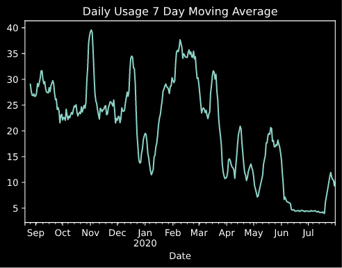
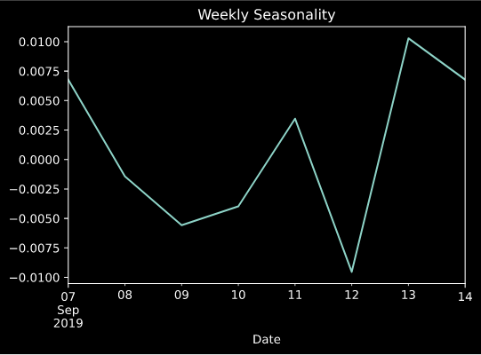
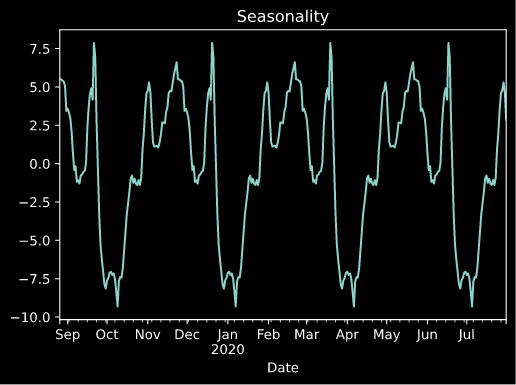
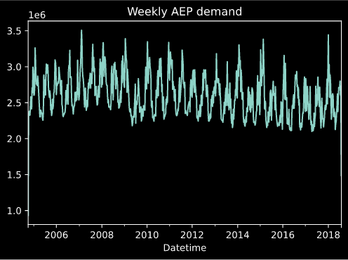
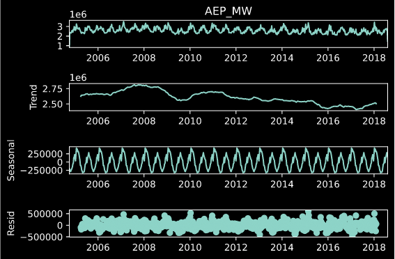
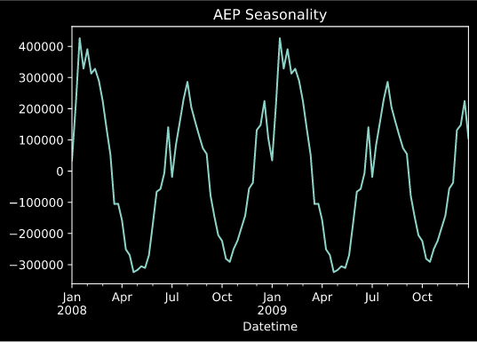
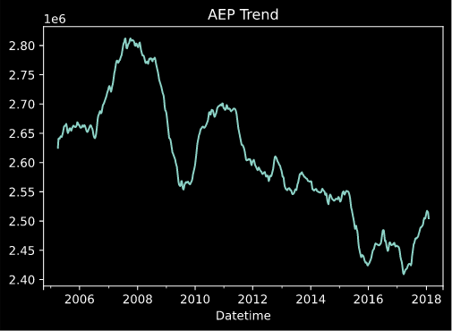
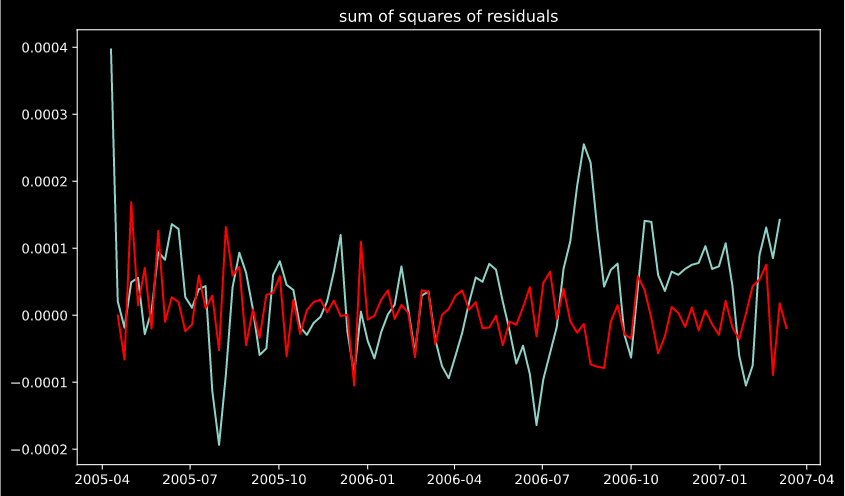
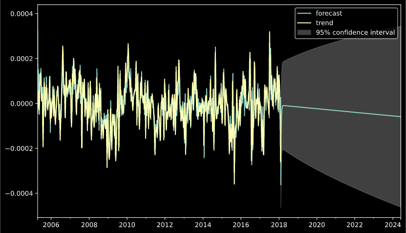

> 
###### A Project to Forcast My Montly Power Usage And Bill

I decided to start this project to help me accurately budget my montly bills. My montly electric bill swings wildly each month, depending on the season and other factors such as the acedemic calendar. I wanted to build a forcast system to automatically tell me how much I should expect to spend each month on power.

## Development Process:
### EDA:

You can see the high variance in my montly power usage with this weekly-usage chart:

> 

In fact, the daily usage data has a variance of 116.44 kWh. In order to make this data have less variance, I used a 7 day moving average for my data.

To remove further variance and randomness, I decomposed the data into seasonality, trend, and noise/residule.

Here is the weekly seanonality:

> 

And the general seasonality:

> 

Due to a lack of data (Only being a resident for a year), I tested my modeling on a larger dataset, The AEP hourly power demand. I used this data to test a model. As more data becomes avaliable for my personal data, I will use the same process to build a personal model and have it updated montly with new data.

Here is the weekly demand plot:

> 

And the decomposition:

> 

And the general seasonality:

> 

After removing seasonality and data from the data, the trend is the only value left to model:

> 

## Initial Model: ARIMA

The First initial attempt at modeling usage used an ARIMA model. This model requires a staionary trend dataset, so I spent time making the time series trend stationary. 
To do this, I transformed my data into a difference in log scale weighted mean. The weighted mean in log scale was subtraced from the same shifted data to get a 'difference between times' dataset. After transformation the data looked like the following:
 
> 

After stationarizing the data, I used statmodels module to create an ARIMA model. 
 
The initial results are as follows.
The predicted power usage is in red, and the actual power usage is blue:
> 
 
And the general trend forcast for the next 4 years are shown in blue here:

> 

 
The benfits of this model is it was fast and simple to create. This model is somewhat limited though, since other variables like weather is dificult to incoperate in the model. In order to improve uppon this model, I explored several more modeling techniques

# Second Model: Seq2Seq Network
> Readme is a work in progress

## Meta

Sam Rossilli – Sarossilli@gmail.com – Srossill@uccs.edu

[https://github.com/sarossilli/](https://github.com/sarossilli/)

## Using Your Own Data:

1. Fork it (<https://github.com/sarossilli/Power-Usage-Prediction/fork>)
2. Create your feature branch (`git checkout -b feature/fooBar`)
3. Commit your changes (`git commit -am 'Add some fooBar'`)
4. Push to the branch (`git push origin feature/fooBar`)
5. Create a new Pull Request

